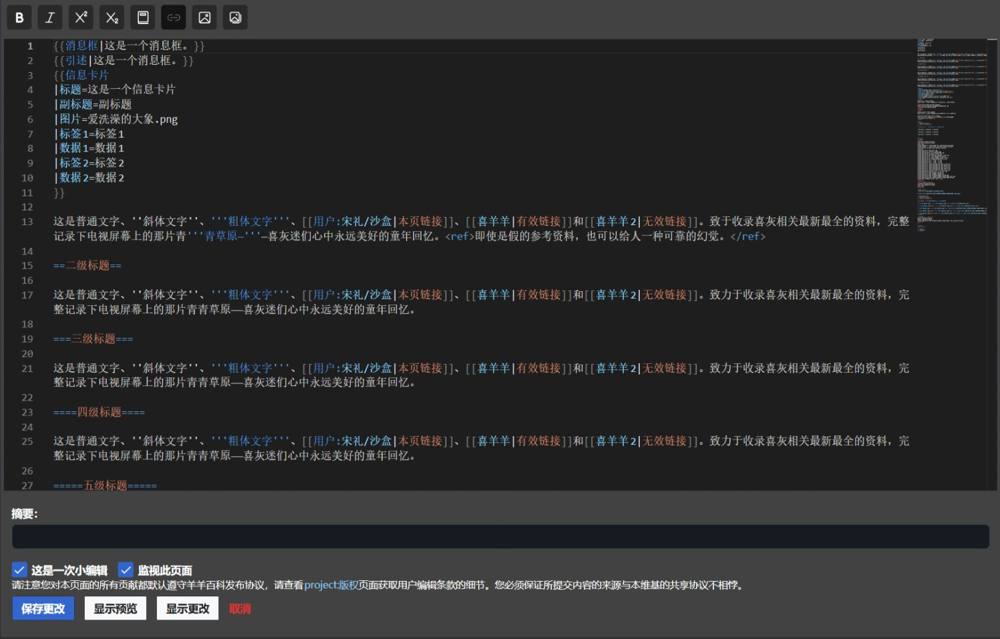

# Monaco Editor for MediaWiki

> Bringing a modern editing experience to wikis! ✨

Monaco Editor for MediaWiki (ME4M) enhances wiki editing by integrating Microsoft's [Monaco Editor](https://github.com/microsoft/monaco-editor) (which powers [VS Code](https://github.com/microsoft/vscode)) and a suite of tools tailored for wiki editors.

## 🚀 How to Use

If your wiki supports personal JavaScript, simply copy and paste the following code into your personal JS page. Voilà, you're all set!

```js
mw.loader.load(
  "https://xyy-huijiwiki.github.io/monaco-editor-for-mediawiki/entry.js"
);
```

## 🌟 Features



- **All the goodness of Monaco Editor** – Multiple selections, Find & Replace, Code Folding, and more!
- **Wikitext syntax highlighting** – Thanks to [Frederisk/Wikitext-VSCode-Extension](https://github.com/Frederisk/Wikitext-VSCode-Extension) and [shikijs/textmate-grammars-themes](https://github.com/shikijs/textmate-grammars-themes).
- **Auto light/dark theme** – Because your eyes deserve comfort. 😎
- **A handy toolbar for wiki formatting** – Quickly insert bold text, italics, thumbnail images, galleries, and more.
- **Keyboard shortcuts** –
  - `Ctrl + B` for **bold text**
  - `Ctrl + I` for _italic text_
- **Multilingual support** –
  - Editor: Uses Monaco Editor’s supported locales.
  - Toolbar: Supports the locales available in [WikiEditor](wikimedia/mediawiki-extensions-WikiEditor).

## ⚠️ Limitations

- Currently, all functions have been thoroughly tested only on [XYY HuijiWiki](https://xyy.huijiwiki.com).

## 🛠️ To-Do

- Rewrite the toolbar using a modern framework (Vue or React).
- Test on other wikis.
- Externalise `monaco-editor`.
- Improve lua debug experience.

---

Give it a spin and enjoy a **VS Code-like** experience inside your favourite wiki! 🚀
